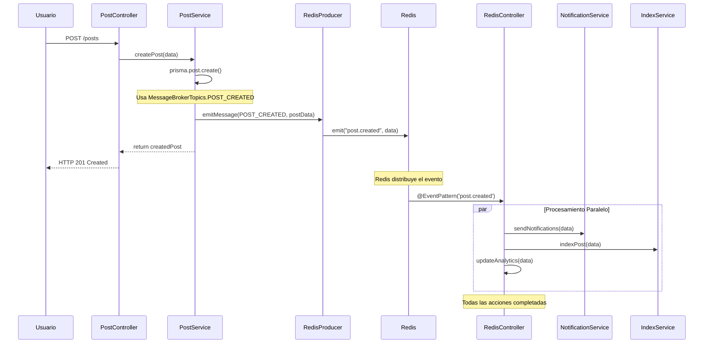

# 🏷️ Redis Topics - Guía de Eventos

Esta documentación explica el funcionamiento del archivo `topics.ts`, su propósito, estructura y cómo utilizarlo en el sistema de eventos de BlogApp.

## 📋 Tabla de Contenidos

- [🎯 ¿Qué es el archivo topics.ts?](#-qué-es-el-archivo-topicsts)
- [🔍 Análisis del Código](#-análisis-del-código)
- [📡 ¿Qué son los Topics en Redis?](#-qué-son-los-topics-en-redis)
- [🏗️ Estructura y Organización](#️-estructura-y-organización)
- [🚀 Cómo se Utiliza en la Práctica](#-cómo-se-utiliza-en-la-práctica)
- [✨ Ventajas del Uso de Enums](#-ventajas-del-uso-de-enums)
- [🌐 Flujo Completo de un Evento](#-flujo-completo-de-un-evento)
- [🎛️ Ejemplos Prácticos por Categoría](#️-ejemplos-prácticos-por-categoría)
- [🔧 Extensibilidad y Mantenimiento](#-extensibilidad-y-mantenimiento)
- [📊 Mejores Prácticas](#-mejores-prácticas)
- [🎯 Casos de Uso Avanzados](#-casos-de-uso-avanzados)

---

## 🎯 **¿Qué es el archivo topics.ts?**

El archivo `topics.ts` es el **"diccionario de eventos"** central del sistema Redis Message Broker. Define todos los **canales de comunicación** (topics/temas) disponibles en la aplicación BlogApp.

### **Función Principal**
- 📋 **Centraliza** la definición de todos los eventos del sistema
- 🔒 **Proporciona type safety** con TypeScript
- 🏷️ **Organiza eventos** por categorías lógicas
- 🔄 **Facilita mantenimiento** y refactoring
- 📚 **Documenta automáticamente** qué eventos existen

### **Analogía**
Piensa en los topics como **"estaciones de radio"**:
- Los **productores** (servicios) **transmiten** mensajes en una estación específica
- Los **consumidores** (handlers) **sintonizan** estaciones para escuchar mensajes
- Redis actúa como el **"éter"** que transporta las señales

---

## 🔍 **Análisis del Código**

### **Estructura del Enum**
```typescript
export enum MessageBrokerTopics {
  // Posts - Eventos relacionados con publicaciones
  POST_CREATED = "post.created",    // 📝 Nuevo post creado
  POST_UPDATED = "post.updated",    // ✏️ Post modificado
  POST_DELETED = "post.deleted",    // 🗑️ Post eliminado
  POST_VIEWED = "post.viewed",      // 👀 Post visualizado
  
  // Users - Eventos relacionados con usuarios
  USER_CREATED = "user.created",    // 👤 Nuevo usuario registrado
  USER_UPDATED = "user.updated",    // 🔄 Perfil actualizado
  USER_DELETED = "user.deleted",    // ❌ Cuenta eliminada
  USER_LOGIN = "user.login",        // 🔓 Usuario hace login
  
  // Weather - Eventos meteorológicos
  WEATHER_UPDATED = "weather.updated", // 🌤️ Datos climáticos actualizados
  
  // System - Eventos del sistema
  SYSTEM_HEALTH_CHECK = "system.health_check", // 🏥 Monitoreo de salud
}
```

### **Type Union y Exports**
```typescript
// Union type para type safety
export type AllMessageBrokerTopics = MessageBrokerTopics;

// Export por defecto para flexibilidad
export default MessageBrokerTopics;
```

**Propósito de cada export:**
- `MessageBrokerTopics`: Enum principal con todos los eventos
- `AllMessageBrokerTopics`: Type union para parámetros de funciones
- `default export`: Permite importaciones flexibles

---

## 📡 **¿Qué son los Topics en Redis?**

### **Definición Técnica**
Los topics son **identificadores únicos de canales** en el sistema de pub/sub de Redis que permiten:

- 📤 **Publicar mensajes** en canales específicos
- 📥 **Suscribirse** a canales para recibir mensajes
- 🔀 **Routear eventos** a handlers apropiados
- 🏷️ **Organizar comunicación** por dominio/funcionalidad

### **Convención de Nomenclatura**
```typescript
// Patrón: [DOMINIO].[ACCIÓN]
POST_CREATED = "post.created"     // dominio: post, acción: created
USER_LOGIN = "user.login"         // dominio: user, acción: login
WEATHER_UPDATED = "weather.updated" // dominio: weather, acción: updated
```

**Beneficios del patrón:**
- ✅ **Legible y descriptivo**
- ✅ **Fácil de filtrar** (`post.*` para todos los eventos de posts)
- ✅ **Escalable** para nuevos dominios
- ✅ **Compatible** con herramientas de monitoreo

### **Mapeo Técnico**
```typescript
// En el Producer (envío)
this.redisClient.emit("post.created", messageData);

// En el Consumer (recepción)
@EventPattern('post.created')
async handlePostCreated(@Payload() data: any) { }

// El enum garantiza consistencia
MessageBrokerTopics.POST_CREATED === "post.created" // true
```

---

## 🏗️ **Estructura y Organización**

### **1. 📝 Posts Events**
```typescript
POST_CREATED = "post.created",    // ✨ Evento más importante
POST_UPDATED = "post.updated",    // 🔄 Cambios en contenido
POST_DELETED = "post.deleted",    // 🗑️ Eliminación
POST_VIEWED = "post.viewed",      // 📊 Analytics de visualización
```

**Casos de uso:**
- **POST_CREATED**: Notificaciones, indexación, analytics
- **POST_UPDATED**: Reindexación, cache invalidation
- **POST_DELETED**: Cleanup, estadísticas
- **POST_VIEWED**: Métricas, recomendaciones

### **2. 👤 User Events**
```typescript
USER_CREATED = "user.created",    // 🎉 Nuevo registro
USER_UPDATED = "user.updated",    // 🔄 Cambios de perfil
USER_DELETED = "user.deleted",    // 💔 Eliminación de cuenta
USER_LOGIN = "user.login",        // 🔓 Actividad de sesión
```

**Casos de uso:**
- **USER_CREATED**: Welcome emails, setup inicial
- **USER_UPDATED**: Sync de datos, cache refresh
- **USER_DELETED**: Cleanup masivo, GDPR compliance
- **USER_LOGIN**: Security tracking, analytics

### **3. 🌤️ Weather Events**
```typescript
WEATHER_UPDATED = "weather.updated", // 🌦️ Datos meteorológicos
```

**Casos de uso:**
- **WEATHER_UPDATED**: Actualizar posts relacionados, notificaciones climáticas

### **4. 🔧 System Events**
```typescript
SYSTEM_HEALTH_CHECK = "system.health_check", // 💓 Monitoreo
```

**Casos de uso:**
- **SYSTEM_HEALTH_CHECK**: Alertas, métricas, reporting

### **Escalabilidad de la Estructura**
```typescript
// Fácil añadir nuevas categorías
export enum MessageBrokerTopics {
  // ... eventos existentes
  
  // 💬 Comments (nueva categoría)
  COMMENT_CREATED = "comment.created",
  COMMENT_UPDATED = "comment.updated", 
  COMMENT_DELETED = "comment.deleted",
  
  // 👍 Reactions (nueva categoría)
  LIKE_ADDED = "like.added",
  LIKE_REMOVED = "like.removed",
  
  // 🔔 Notifications (nueva categoría)
  NOTIFICATION_SENT = "notification.sent",
  NOTIFICATION_READ = "notification.read",
}
```

---

## 🚀 **Cómo se Utiliza en la Práctica**

### **1. Importación del Enum**
```typescript
// Importación named
import { MessageBrokerTopics } from '../redis/topics';

// Importación default
import Topics from '../redis/topics';

// Importación type-only
import type { AllMessageBrokerTopics } from '../redis/topics';
```

### **2. En el Producer (Envío de Eventos)**
```typescript
import { Injectable } from '@nestjs/common';
import { RedisProducerService } from '../redis/redis.producer.service';
import { MessageBrokerTopics } from '../redis/topics';

@Injectable()
export class PostService {
  constructor(private redisProducer: RedisProducerService) {}
  
  async createPost(data: PostCreateInput) {
    // 1. Lógica de creación
    const post = await this.prisma.post.create(data);
    
    // 2. Envío de evento usando el enum
    await this.redisProducer.emitMessage(
      MessageBrokerTopics.POST_CREATED, // ← Type safe
      {
        id: post.id,
        title: post.title,
        userId: post.userId,
        timestamp: new Date().toISOString()
      }
    );
    
    return post;
  }
}
```

### **3. En el Consumer (Recepción de Eventos)**
```typescript
import { Controller } from '@nestjs/common';
import { EventPattern, Payload } from '@nestjs/microservices';

@Controller('redis-controller')
export class RedisController {
  
  // El string debe coincidir exactamente con el enum value
  @EventPattern('post.created') // ← MessageBrokerTopics.POST_CREATED
  async handlePostCreated(@Payload() data: PostCreatedEvent) {
    console.log('📝 Nuevo post:', data.title);
    
    // Lógica de procesamiento
    await this.processNewPost(data);
  }
  
  @EventPattern('user.login') // ← MessageBrokerTopics.USER_LOGIN
  async handleUserLogin(@Payload() data: UserLoginEvent) {
    console.log('🔓 Login de usuario:', data.userId);
    
    // Lógica de tracking
    await this.trackUserActivity(data);
  }
}
```

### **4. Validación Type-Safe**
```typescript
// Función que acepta solo topics válidos
async function emitEvent(
  topic: AllMessageBrokerTopics, // ← Solo acepta valores del enum
  data: any
) {
  await redisProducer.emitMessage(topic, data);
}

// Uso correcto
await emitEvent(MessageBrokerTopics.POST_CREATED, postData); // ✅

// Error de compilación
await emitEvent("invalid.topic", postData); // ❌ TypeScript error
```

---

## ✨ **Ventajas del Uso de Enums**

### **🔒 Type Safety (Seguridad de Tipos)**
```typescript
// ✅ CORRECTO - TypeScript proporciona autocompletado
await this.redisProducer.emitMessage(
  MessageBrokerTopics.POST_CREATED, // IDE sugiere opciones válidas
  postData
);

// ❌ ERROR - TypeScript detecta el typo
await this.redisProducer.emitMessage(
  MessageBrokerTopics.POST_CRETED, // Error de compilación
  postData
);

// ❌ ERROR - String literal incorrecto
await this.redisProducer.emitMessage(
  "post.creted", // Typo no detectado en runtime, pero inconsistente
  postData
);
```

### **🔄 Refactoring Seguro**
```typescript
// Si necesitas cambiar un topic name:
// ANTES
POST_CREATED = "post.created"

// DESPUÉS
POST_CREATED = "post.created.v2"

// RESULTADO: 
// ✅ Todos los usos se actualizan automáticamente
// ✅ Compilador verifica consistencia
// ✅ No hay referencias perdidas
```

### **📚 Auto-Documentación**
```typescript
// El enum sirve como documentación viva
export enum MessageBrokerTopics {
  // 📝 Posts: Eventos del ciclo de vida de publicaciones
  POST_CREATED = "post.created",    // Disparado cuando se crea un nuevo post
  POST_UPDATED = "post.updated",    // Disparado cuando se modifica un post
  POST_DELETED = "post.deleted",    // Disparado cuando se elimina un post
  POST_VIEWED = "post.viewed",      // Disparado cuando alguien ve un post
  
  // 👤 Users: Eventos relacionados con usuarios  
  USER_CREATED = "user.created",    // Nuevo usuario registrado
  USER_LOGIN = "user.login",        // Usuario inicia sesión
  
  // ... más eventos documentados
}
```

### **🔍 Discoverability (Descubrimiento)**
```typescript
// Los developers pueden descubrir eventos disponibles
import { MessageBrokerTopics } from '../redis/topics';

// IDE muestra todos los eventos disponibles al escribir:
MessageBrokerTopics. // ← Autocomplete muestra todas las opciones
//                  POST_CREATED
//                  POST_UPDATED  
//                  POST_DELETED
//                  USER_CREATED
//                  etc...
```

### **🛡️ Consistencia Garantizada**
```typescript
// Imposible usar nombres inconsistentes
const topic1 = MessageBrokerTopics.POST_CREATED; // "post.created"
const topic2 = MessageBrokerTopics.POST_CREATED; // "post.created" (mismo valor)

// Sin enum, podrías tener inconsistencias:
const topic1 = "post.created";
const topic2 = "postCreated";    // ❌ Inconsistente
const topic3 = "post_created";   // ❌ Inconsistente
const topic4 = "POST.CREATED";   // ❌ Inconsistente
```

---

## 🌐 **Flujo Completo de un Evento**

### **Secuencia Temporal Completa**


### **Código del Flujo Completo**
```typescript
// 1. Controller recibe request
@Post()
async createPost(@Body() data: PostCreateInput) {
  return await this.postService.createPost(data);
}

// 2. Service procesa y emite evento
async createPost(data: PostCreateInput) {
  const post = await this.prisma.post.create(data);
  
  // 3. Emite evento usando enum
  await this.redisProducer.emitMessage(
    MessageBrokerTopics.POST_CREATED, // ← Desde topics.ts
    {
      id: post.id,
      title: post.title,
      userId: post.userId,
      createdAt: post.createdAt
    }
  );
  
  return post; // 4. Respuesta rápida al usuario
}

// 5. Redis Controller procesa evento asincrónicamente
@EventPattern('post.created') // ← Debe coincidir con enum value
async handlePostCreated(@Payload() data: PostCreatedEvent) {
  // 6. Ejecutar acciones en paralelo
  await Promise.allSettled([
    this.notificationService.notifyFollowers(data.userId),
    this.searchService.indexPost(data.id),
    this.analyticsService.trackPostCreation(data),
    this.cacheService.invalidateUserPosts(data.userId)
  ]);
}
```

---

## 🎛️ **Ejemplos Prácticos por Categoría**

### **📝 Posts Events - Casos Reales**

#### **POST_CREATED Example**
```typescript
// En PostService
async createPost(args: Prisma.PostCreateArgs) {
  const post = await super.createPost(args);
  
  // Emitir evento POST_CREATED
  await this.redisProducer.emitMessage(
    MessageBrokerTopics.POST_CREATED,
    {
      id: post.id,
      title: post.title,
      content: post.content.substring(0, 200), // Preview
      authorId: post.userId,
      category: this.extractCategory(post.content),
      tags: this.extractTags(post.content),
      publishedAt: post.createdAt,
      isPublic: true
    }
  );
  
  return post;
}

// En RedisController  
@EventPattern('post.created')
async handlePostCreated(@Payload() data: PostCreatedEvent) {
  console.log(`📝 Nuevo post: "${data.title}" por usuario ${data.authorId}`);
  
  // Acciones automáticas
  const actions = await Promise.allSettled([
    // Notificaciones
    this.notificationService.notifyFollowers({
      authorId: data.authorId,
      postId: data.id,
      message: `${data.authorId} publicó: ${data.title}`
    }),
    
    // Indexación para búsqueda
    this.searchService.indexPost({
      id: data.id,
      title: data.title,
      content: data.content,
      tags: data.tags,
      category: data.category
    }),
    
    // Analytics
    this.analyticsService.trackEvent('post_created', {
      postId: data.id,
      authorId: data.authorId,
      category: data.category,
      timestamp: data.publishedAt
    }),
    
    // Social media auto-post
    this.socialMediaService.autoPost({
      platform: 'twitter',
      message: `Nuevo post: ${data.title}`,
      link: `https://blog.com/posts/${data.id}`
    }),
    
    // Cache warming
    this.cacheService.warmCache([
      `posts:recent`,
      `posts:by-user:${data.authorId}`,
      `posts:by-category:${data.category}`
    ])
  ]);
  
  // Log resultados
  this.logActionResults('POST_CREATED', actions);
}
```

#### **POST_VIEWED Example**
```typescript
// En PostService
async findPost(id: string) {
  const post = await this.prisma.post.findUnique({ where: { id } });
  
  if (post) {
    // Emitir evento de visualización
    await this.redisProducer.emitMessage(
      MessageBrokerTopics.POST_VIEWED,
      {
        postId: post.id,
        title: post.title,
        authorId: post.userId,
        viewedAt: new Date().toISOString(),
        viewerIP: this.request.ip, // Para analytics
        userAgent: this.request.headers['user-agent']
      }
    );
  }
  
  return post;
}

// En RedisController
@EventPattern('post.viewed')
async handlePostViewed(@Payload() data: PostViewedEvent) {
  console.log(`👀 Post "${data.title}" visualizado`);
  
  await Promise.allSettled([
    // Incrementar contador de vistas
    this.statisticsService.incrementViewCount(data.postId),
    
    // Analytics de popularidad
    this.popularityService.updateScore({
      postId: data.postId,
      viewedAt: data.viewedAt,
      viewerInfo: {
        ip: data.viewerIP,
        userAgent: data.userAgent
      }
    }),
    
    // Sistema de recomendaciones
    this.recommendationService.updateUserPreferences({
      postId: data.postId,
      authorId: data.authorId,
      viewerIP: data.viewerIP
    }),
    
    // Trending topics
    this.trendingService.trackView({
      postId: data.postId,
      timestamp: data.viewedAt
    })
  ]);
}
```

### **👤 User Events - Casos Reales**

#### **USER_CREATED Example**
```typescript
// En UserService
async createUser(data: UserCreateInput) {
  const user = await this.prisma.user.create(data);
  
  // Emitir evento USER_CREATED
  await this.redisProducer.emitMessage(
    MessageBrokerTopics.USER_CREATED,
    {
      userId: user.id,
      email: user.email,
      username: user.username,
      registeredAt: user.createdAt,
      registrationIP: this.request.ip,
      referrer: this.request.headers.referer || null
    }
  );
  
  return user;
}

// En RedisController
@EventPattern('user.created') 
async handleUserCreated(@Payload() data: UserCreatedEvent) {
  console.log(`👤 Nuevo usuario registrado: ${data.username}`);
  
  await Promise.allSettled([
    // Email de bienvenida
    this.emailService.sendWelcomeEmail({
      to: data.email,
      username: data.username,
      template: 'welcome-new-user'
    }),
    
    // Setup inicial del perfil
    this.profileService.createDefaultProfile({
      userId: data.userId,
      username: data.username
    }),
    
    // Analytics de registro
    this.analyticsService.trackUserRegistration({
      userId: data.userId,
      registeredAt: data.registeredAt,
      source: data.referrer || 'direct'
    }),
    
    // Asignar logros iniciales
    this.achievementService.grantInitialBadges({
      userId: data.userId,
      badges: ['welcome', 'first-steps']
    }),
    
    // Configurar preferencias por defecto
    this.preferencesService.setDefaults({
      userId: data.userId,
      notifications: true,
      newsletter: true
    })
  ]);
}
```

#### **USER_LOGIN Example**
```typescript
// En AuthService
async login(credentials: LoginCredentials) {
  const user = await this.validateCredentials(credentials);
  const token = await this.generateJWT(user);
  
  // Emitir evento USER_LOGIN
  await this.redisProducer.emitMessage(
    MessageBrokerTopics.USER_LOGIN,
    {
      userId: user.id,
      username: user.username,
      loginAt: new Date().toISOString(),
      ipAddress: this.request.ip,
      userAgent: this.request.headers['user-agent'],
      location: await this.geoService.getLocation(this.request.ip)
    }
  );
  
  return { user, token };
}

// En RedisController
@EventPattern('user.login')
async handleUserLogin(@Payload() data: UserLoginEvent) {
  console.log(`🔓 Login: ${data.username} desde ${data.location?.city}`);
  
  await Promise.allSettled([
    // Actualizar último acceso
    this.userService.updateLastAccess({
      userId: data.userId,
      lastLoginAt: data.loginAt,
      lastLoginIP: data.ipAddress
    }),
    
    // Security monitoring
    this.securityService.checkSuspiciousActivity({
      userId: data.userId,
      ipAddress: data.ipAddress,
      location: data.location,
      previousLogins: await this.getRecentLogins(data.userId)
    }),
    
    // Analytics de actividad
    this.analyticsService.trackUserActivity({
      userId: data.userId,
      event: 'login',
      timestamp: data.loginAt,
      metadata: {
        location: data.location,
        userAgent: data.userAgent
      }
    }),
    
    // Sincronización de datos
    this.syncService.syncUserData({
      userId: data.userId,
      lastSyncAt: data.loginAt
    }),
    
    // Cargar configuraciones de usuario
    this.configService.preloadUserConfig({
      userId: data.userId
    })
  ]);
}
```

---

## 🔧 **Extensibilidad y Mantenimiento**

### **Añadir Nuevos Topics**
```typescript
// Extensión fácil del enum
export enum MessageBrokerTopics {
  // ... eventos existentes
  
  // 💬 Comentarios (nueva funcionalidad)
  COMMENT_CREATED = "comment.created",
  COMMENT_UPDATED = "comment.updated",
  COMMENT_DELETED = "comment.deleted",
  COMMENT_APPROVED = "comment.approved",
  COMMENT_FLAGGED = "comment.flagged",
  
  // 📧 Notificaciones
  NOTIFICATION_EMAIL_SENT = "notification.email.sent",
  NOTIFICATION_PUSH_SENT = "notification.push.sent",
  NOTIFICATION_SMS_SENT = "notification.sms.sent",
  
  // 🔍 Búsqueda y SEO
  SEARCH_INDEX_UPDATED = "search.index.updated",
  SEO_METADATA_GENERATED = "seo.metadata.generated",
  SITEMAP_UPDATED = "sitemap.updated",
  
  // 📊 Analytics Avanzados
  ANALYTICS_PAGE_VIEW = "analytics.page_view",
  ANALYTICS_EVENT_TRACKED = "analytics.event.tracked",
  ANALYTICS_CONVERSION = "analytics.conversion",
  
  // 🤖 AI y Machine Learning
  AI_CONTENT_ANALYZED = "ai.content.analyzed",
  AI_RECOMMENDATION_UPDATED = "ai.recommendation.updated",
  AI_MODERATION_FLAGGED = "ai.moderation.flagged",
}
```

### **Versionado de Topics**
```typescript
// Estrategia de versionado para cambios breaking
export enum MessageBrokerTopics {
  // Versión actual
  POST_CREATED = "post.created.v2",
  
  // Versión legacy (mantener durante transición)
  POST_CREATED_V1 = "post.created.v1",
  
  // Nueva versión con estructura diferente
  POST_CREATED_V3 = "post.created.v3",
}

// Handlers para múltiples versiones
@EventPattern('post.created.v1')
async handlePostCreatedV1(@Payload() data: PostCreatedEventV1) {
  // Lógica legacy
}

@EventPattern('post.created.v2') 
async handlePostCreatedV2(@Payload() data: PostCreatedEventV2) {
  // Lógica actual
}
```

### **Organización por Módulos**
```typescript
// Para proyectos grandes, considerar organización modular
export namespace PostTopics {
  export const CREATED = "post.created";
  export const UPDATED = "post.updated";
  export const DELETED = "post.deleted";
}

export namespace UserTopics {
  export const CREATED = "user.created";
  export const LOGIN = "user.login";
  export const LOGOUT = "user.logout";
}

// Uso
await this.redisProducer.emitMessage(PostTopics.CREATED, data);
```

### **Validación de Topics**
```typescript
// Validación runtime de topics
export function isValidTopic(topic: string): topic is AllMessageBrokerTopics {
  return Object.values(MessageBrokerTopics).includes(topic as MessageBrokerTopics);
}

// Uso en middleware
export function validateTopic(topic: string) {
  if (!isValidTopic(topic)) {
    throw new Error(`Invalid topic: ${topic}`);
  }
}
```

---

## 📊 **Mejores Prácticas**

### **🎯 Convenciones de Nomenclatura**
```typescript
// ✅ BUENAS PRÁCTICAS
POST_CREATED = "post.created"        // Dominio claro + acción en pasado
USER_LOGIN = "user.login"            // Verbo específico
WEATHER_UPDATED = "weather.updated"  // Estado resultante claro

// ❌ EVITAR
POST = "post"                        // Muy genérico
CREATE_POST = "create.post"          // Orden invertido
POST_NEW = "post.new"               // "new" es ambiguo
POSTCREATED = "postcreated"         // Sin separador
```

### **📝 Documentación Inline**
```typescript
export enum MessageBrokerTopics {
  /**
   * 📝 Emitido cuando se crea un nuevo post
   * 
   * Payload: PostCreatedEvent
   * - id: string - ID único del post
   * - title: string - Título del post  
   * - authorId: string - ID del autor
   * - createdAt: string - ISO timestamp
   * 
   * Handlers:
   * - NotificationService: Envía notificaciones a seguidores
   * - SearchService: Indexa el contenido
   * - AnalyticsService: Registra métricas
   */
  POST_CREATED = "post.created",
  
  /**
   * 👀 Emitido cuando alguien visualiza un post
   * 
   * Payload: PostViewedEvent
   * - postId: string - ID del post visualizado
   * - viewedAt: string - ISO timestamp
   * - viewerIP?: string - IP del viewer (opcional)
   * 
   * Handlers:  
   * - StatisticsService: Incrementa contador de vistas
   * - RecommendationService: Actualiza algoritmos
   */
  POST_VIEWED = "post.viewed",
}
```

### **🔧 Type Safety Avanzado**
```typescript
// Interfaces específicas por evento
export interface PostCreatedEvent {
  id: string;
  title: string;
  authorId: string; 
  createdAt: string;
}

export interface UserLoginEvent {
  userId: string;
  loginAt: string;
  ipAddress: string;
}

// Mapeo de topics a tipos de payload
export type TopicPayloadMap = {
  [MessageBrokerTopics.POST_CREATED]: PostCreatedEvent;
  [MessageBrokerTopics.USER_LOGIN]: UserLoginEvent;
  // ... más mappings
};

// Producer type-safe
class TypeSafeRedisProducer {
  async emitMessage<T extends AllMessageBrokerTopics>(
    topic: T,
    payload: TopicPayloadMap[T]
  ): Promise<void> {
    // Implementación
  }
}
```

### **📊 Monitoring y Observabilidad**
```typescript
// Métricas por topic
export class TopicMetrics {
  private static metrics = new Map<string, number>();
  
  static increment(topic: AllMessageBrokerTopics) {
    const current = this.metrics.get(topic) || 0;
    this.metrics.set(topic, current + 1);
  }
  
  static getStats() {
    return Object.fromEntries(this.metrics);
  }
}

// Uso en producers
await this.redisProducer.emitMessage(topic, payload);
TopicMetrics.increment(topic);
```

---

## 🎯 **Casos de Uso Avanzados**

### **1. 🔄 Event Sourcing**
```typescript
// Topics para event sourcing
export enum EventSourcingTopics {
  // Eventos de dominio inmutables
  POST_CREATED_EVENT = "events.post.created",
  POST_TITLE_CHANGED_EVENT = "events.post.title_changed", 
  POST_PUBLISHED_EVENT = "events.post.published",
  POST_ARCHIVED_EVENT = "events.post.archived",
}

// Reconstrucción de estado desde eventos
@EventPattern('events.post.*') // Pattern matching
async handlePostEvent(@Payload() event: DomainEvent) {
  await this.eventStore.append(event);
  await this.projectionService.updateProjections(event);
}
```

### **2. 🎭 Saga Pattern**
```typescript
// Topics para coordinar transacciones distribuidas
export enum SagaTopics {
  // Iniciar saga
  ORDER_SAGA_STARTED = "saga.order.started",
  
  // Steps de la saga
  PAYMENT_PROCESSING = "saga.payment.processing",
  INVENTORY_RESERVED = "saga.inventory.reserved",
  SHIPPING_SCHEDULED = "saga.shipping.scheduled",
  
  // Compensaciones
  PAYMENT_CANCELLED = "saga.payment.cancelled",
  INVENTORY_RELEASED = "saga.inventory.released",
}
```

### **3. 📡 Cross-Service Communication**
```typescript
// Topics para comunicación entre microservicios
export enum CrossServiceTopics {
  // De BlogService a UserService
  USER_PROFILE_UPDATE_REQUEST = "cross.user_service.profile_update",
  
  // De UserService a NotificationService  
  NOTIFICATION_SEND_REQUEST = "cross.notification_service.send",
  
  // De BlogService a SearchService
  SEARCH_INDEX_REQUEST = "cross.search_service.index",
}
```

### **4. 🔔 Real-time Notifications**
```typescript
// Topics para notificaciones en tiempo real
export enum RealtimeTopics {
  // WebSocket broadcasting
  REALTIME_POST_CREATED = "realtime.post.created",
  REALTIME_COMMENT_ADDED = "realtime.comment.added", 
  REALTIME_USER_ONLINE = "realtime.user.online",
  REALTIME_TYPING_INDICATOR = "realtime.typing",
}

// Handler para WebSocket
@EventPattern('realtime.*')
async handleRealtimeEvent(@Payload() data: RealtimeEvent) {
  // Broadcast via WebSocket
  this.websocketGateway.broadcast(data.topic, data.payload);
}
```

---

## 🎉 **Conclusión**

El archivo `topics.ts` es una pieza **fundamental** del sistema de eventos de BlogApp que proporciona:

### **✅ Beneficios Inmediatos**
- **Type safety** completo en TypeScript
- **Autocompletado** y validación en IDE  
- **Refactoring seguro** de nombres de eventos
- **Documentación automática** de eventos disponibles

### **✅ Beneficios Arquitectónicos** 
- **Centralización** de definiciones de eventos
- **Consistencia** garantizada en nombres
- **Escalabilidad** para nuevos tipos de eventos
- **Mantenibilidad** a largo plazo

### **✅ Beneficios de Desarrollo**
- **Developer experience** mejorada
- **Onboarding** más rápido para nuevos developers
- **Menos bugs** por typos o inconsistencias
- **Testing** más fácil con tipos conocidos

### **🚀 Evolución Futura**
El archivo está **preparado para crecer** con el proyecto, soportando:
- Nuevos dominios de negocio
- Microservicios adicionales  
- Integraciones complejas
- Patrones avanzados como Event Sourcing

**El sistema de topics es la base sólida** sobre la cual se construye toda la arquitectura orientada a eventos de BlogApp, garantizando comunicación confiable, type-safe y escalable entre todos los componentes del sistema.

---

**🔗 Enlaces Relacionados:**
- [Guía Completa de Redis](./REDIS_GUIDE.md)
- [Documentación de Arquitectura](./ARCHITECTURE.md)
- [Guía de API](./API_GUIDE.md)

**📅 Última actualización**: Octubre 2025